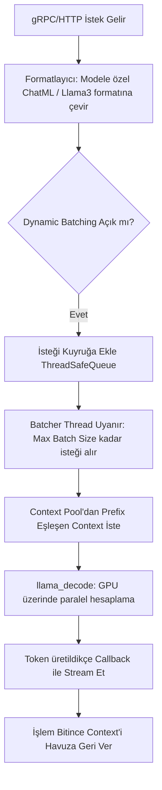

# 🧬 LLM Engine Domain Logic & Algoritmalar

Bu belge, `sentiric-llm-llama-service`'in saf `llama.cpp`'den ayrılarak nasıl "Production-Grade" bir sunucuya dönüştüğünü sağlayan kritik algoritmaları ve C++ bellek yönetimi sırlarını açıklar.

## 1. Smart Context Caching (L1 Prefix Matching)
RAG (Retrieval-Augmented Generation) isteklerinde sistem promptu ve belge bağlamı çok uzundur. Her istekte bunları baştan hesaplamak (Prompt Processing) ilk token süresini (TTFT) saniyelere çıkarır.

*   **Algoritma:** `LlamaContextPool::acquire(tokens)` metodu, gelen isteğin token dizilimi ile havuzdaki boşta olan (Idle) `llama_context`'lerin son token dizilerini karşılaştırır.
*   **Mekanizma:** En uzun ortak başlangıcı (Longest Matching Prefix) bulan Context seçilir. Uyuşmayan kuyruk kısmı `llama_memory_seq_rm` ile anında silinir. Bu sayede 4000 tokenlık bir RAG isteğinin 3900 tokenı yeniden kullanılabilir (Cache Hit). TTFT süresi 15ms'ye düşer.

## 2. İstek Yaşam Döngüsü (Dynamic Batching)

## 3. LoRA LRU Cache (VRAM Koruması)
Her kullanıcının farklı bir LoRA adaptörü (Örn: Hukukçu, Sağlıkçı) kullanabileceği durumlarda GPU VRAM'i hızla tükenir.
*   **Algoritma (Least Recently Used):** Sistem aynı anda en fazla `MAX_LORA_CACHE_SIZE = 8` adet benzersiz LoRA adaptörünü VRAM'de tutar. 9. adaptör yükleneceğinde, en uzun süredir kullanılmayan adaptör `llama_adapter_lora_free` ile VRAM'den atılır.

## 4. Context Shifting (Sonsuz Metin İşleme)
Modelin `CONTEXT_SIZE` limitinden (Örn: 4096) daha büyük bir sohbet geçmişi gelirse sistem çökmez.
*   **Algoritma:** KV Cache dolduğunda, `llama_memory_seq_rm` ile en eski (başlangıç) kısımdaki tokenlar atılır ve `llama_memory_seq_add` ile kalan tokenlar geriye kaydırılır (Shift).
