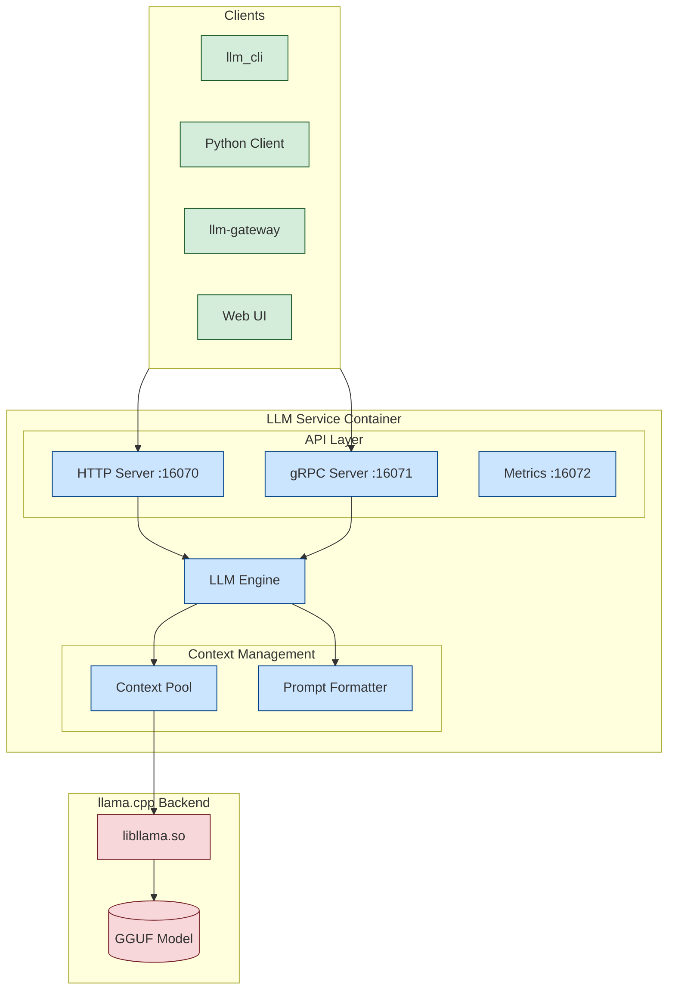

# 🧠 Sentiric LLM Llama Service

**Production-Ready**, yüksek performanslı C++ tabanlı yerel LLM çıkarım motoru. `llama.cpp` ile desteklenir, NVIDIA GPU'lar için optimize edilmiştir ve yeni **Sentiric Omni-Studio** arayüzü ile birlikte gelir.

[](https://github.com/sentiric/sentiric-llm-llama-service/actions/workflows/build-and-push.yml)

## 🚀 Durum: ÜRETİM HAZIR

Bu servis, eşzamanlılık, bellek kararlılığı ve API uyumluluğu için titizlikle test edilmiştir. Temel ekosistem ortamlarında dağıtım için hazırdır.

-   ✅ **Gerçek Eşzamanlılık**: `LlamaContextPool` aracılığıyla birden fazla isteği aynı anda işler
-   ✅ **Derin Sağlık Kontrolleri**: Yük dengeleyiciler için kapasite ve model durumu bilgisi sunar
-   ✅ **Gözlemlenebilirlik**: Yapılandırılmış JSON logları (üretim) ve Prometheus metrikleri
-   ✅ **Güvenlik**: gRPC iletişimi için tam mTLS desteği
-   ✅ **Bağımsız Mod**: Gömülü Studio kullanılarak bağımsız olarak geliştirilebilir ve test edilebilir

---

## 📋 İçindekiler

- [📸 Sentiric Omni-Studio](#-sentiric-omni-studio)
- [✨ Temel Özellikler](#-temel-özellikler)
- [🏗️ Mimari](#️-mimari)
- [🛠️ Hızlı Başlangıç (Bağımsız)](#️-hızlı-başlangıç-bağımsız)
- [⚙️ Yapılandırma](#️-yapılandırma)
- [📊 İzleme & Metrikler](#-i̇zleme--metrikler)
- [🔧 Geliştirme](#-geliştirme)
- [🚀 Dağıtım](#-dağıtım)
- [📚 Dokümantasyon](#-dokümantasyon)
- [🤝 Katkıda Bulunma](#-katkıda-bulunma)
- [📄 Lisans](#-lisans)

---

## 📸 Sentiric Omni-Studio

Servis, `http://localhost:16070` adresinde erişilebilen gömülü bir geliştirme stüdyosu içerir.

**Özellikler:**
-   **Eller Serbest Mod (Hands-Free Mode):** Kesintisiz sesli konuşma döngüsü
-   **RAG Sürükle & Bırak:** Anında bağlam ekleme
-   **Mobil Optimize:** Duyarlı tasarım
-   **Görsel Ses Analizi:** Gerçek zamanlı mikrofon görselleştirici
-   **Token-by-Token Streaming:** Canlı yanıt izleme

---

## ✨ Temel Özellikler

### 🎯 Üretim Özellikleri

- **Gerçek Eşzamanlılık**: Context pooling ile çoklu paralel istek işleme
- **Akıllı Bağlam Yönetimi**: Otomatik context shifting ile sınırsız bağlam desteği
- **GPU Hızlandırma**: NVIDIA GPU'lar için tam destek (CUDA)
- **Model Otomatik İndirme**: Hugging Face'den otomatik model indirme ve doğrulama
- **Çoklu Model Format Desteği**: GGUF formatındaki tüm quantized modeller

### 🔌 API & Entegrasyon

- **OpenAI Uyumlu API**: Standart `/v1/chat/completions` endpoint'i
- **gRPC Streaming**: Düşük gecikmeli, yüksek performanslı RPC
- **mTLS Güvenlik**: İsteğe bağlı karşılıklı TLS kimlik doğrulaması
- **Prometheus Metrikleri**: Üretim ortamı izleme için tam metrik desteği
- **Sağlık Kontrolleri**: Kubernetes/Docker ready endpoints

### 🧠 Gelişmiş Özellikler

- **Otomatik Prompt Formatı Algılama**: Gemma, Llama 3, Qwen 2.5 desteği
- **RAG Desteği**: Built-in bağlam injeksiyonu
- **JSON Modu**: Zorunlu JSON çıktısı için grammar desteği
- **Konuşma Geçmişi**: Çoklu turlu diyalog yönetimi
- **Dinamik Batching**: İsteğe bağlı batch processing (gelecek sürümlerde)

---

## 🏗️ Mimari



### Temel Bileşenler

1. **LLMEngine**: Ana çıkarım motoru, tokenizasyon, sampling ve üretim yönetimi
2. **LlamaContextPool**: RAII tabanlı context pooling ile eşzamanlılık yönetimi
3. **PromptFormatter**: Model mimarisine göre otomatik prompt formatlama
4. **ModelManager**: Otomatik model indirme ve doğrulama

---

## 🛠️ Hızlı Başlangıç (Bağımsız)

### Ön Gereksinimler
-   Docker & Docker Compose
-   NVIDIA GPU (Önerilen - isteğe bağlı)
-   CUDA Toolkit 12.0+ (GPU kullanımı için)

### İzole Çalıştırma

```bash
# 1. Klonla
git clone https://github.com/sentiric/sentiric-llm-llama-service.git
cd sentiric-llm-llama-service

# 2. Başlat (Model ve sertifikaları otomatik indirir)
make up-gpu
# VEYA CPU için:
# make up-cpu
```

**Erişim Noktaları:**
-   **Studio UI:** `http://localhost:16070`
-   **Metrikler:** `http://localhost:16072/metrics`
-   **gRPC:** `localhost:16071`

### İlk İstek

```bash
# CLI ile test
docker compose -f docker-compose.run.gpu.yml run --rm llm-cli llm_cli generate "Merhaba!"

# HTTP API ile test
curl -X POST http://localhost:16070/v1/chat/completions \
  -H "Content-Type: application/json" \
  -d '{
    "messages": [{"role": "user", "content": "Merhaba!"}],
    "stream": false,
    "max_tokens": 100
  }'
```

---

## ⚙️ Yapılandırma

Tüm yapılandırma ortam değişkenleri ile yönetilir. Detaylı yapılandırma referansı için:
**[Yapılandırma Rehberi](./docs/guides/03_CONFIGURATION.md)**

### Temel Ortam Değişkenleri

```bash
# Model Yapılandırması
LLM_LLAMA_SERVICE_MODEL_ID=ggml-org/gemma-3-1b-it-GGUF
LLM_LLAMA_SERVICE_MODEL_FILENAME=gemma-3-1b-it-Q8_0.gguf

# Performans
LLM_LLAMA_SERVICE_GPU_LAYERS=100        # GPU'ya yüklenecek katman sayısı
LLM_LLAMA_SERVICE_CONTEXT_SIZE=4096     # Maksimum context penceresi
LLM_LLAMA_SERVICE_THREADS=4             # Eşzamanlı context sayısı

# Bellek Optimizasyonu
LLM_LLAMA_SERVICE_USE_MMAP=false        # RAM'e tam yükleme
LLM_LLAMA_SERVICE_KV_OFFLOAD=true       # KV cache GPU offload

# Sampling Varsayılanları
LLM_LLAMA_SERVICE_DEFAULT_TEMPERATURE=0.8
LLM_LLAMA_SERVICE_DEFAULT_MAX_TOKENS=1024
```

### Bellek Hesaplama Formülü

```
Toplam VRAM ≈ Model VRAM + (THREADS × Context Başına VRAM)
```

**Örnek (6GB GPU için):**
- Model: gemma-3-1b-it-Q8_0 (~2.5GB)
- THREADS=2, CONTEXT_SIZE=4096
- Context Başına VRAM: ~800MB
- Toplam: 2.5GB + (2 × 0.8GB) = **4.1GB** ✅

---

## 📊 İzleme & Metrikler

### Prometheus Metrikleri

`:16072/metrics` endpoint'inde sunulan temel metrikler:

| Metrik | Açıklama |
| :--- | :--- |
| `llm_active_contexts` | Şu anda meşgul olan context sayısı |
| `llm_requests_total` | İşlenen toplam gRPC istekleri |
| `llm_tokens_generated_total` | Üretilen toplam token sayısı |
| `llm_request_latency_seconds` | İstek işleme sürelerinin histogram'ı |

### Sağlık Kontrolü

```bash
curl http://localhost:16070/health
```

**Yanıt:**
```json
{
  "status": "healthy",
  "model_ready": true,
  "capacity": {
    "active": 1,
    "total": 4,
    "available": 3,
    "has_capacity": true
  },
  "service": "sentiric-llm-llama-service",
  "timestamp": 1734048000
}
```

---

## 🔧 Geliştirme

### Yerel Derleme (Docker ile)

```bash
# GPU ile
docker compose -f docker-compose.yml \
  -f docker-compose.gpu.yml \
  -f docker-compose.gpu.override.yml \
  up --build -d

# CPU ile
docker compose up --build -d
```

### Test Çalıştırma

```bash
# E2E Test Suite
./e2e-test.sh

# CLI ile manuel test
docker compose -f docker-compose.run.gpu.yml run --rm llm-cli \
  llm_cli generate "Test mesajı" --system-prompt "Kısa cevap ver"
```

### Kod Standartları

- **C++ Standard**: C++17
- **Stil**: Google C++ Style Guide
- **Bellek Yönetimi**: RAII prensipleri zorunlu
- **Hata Yönetimi**: Exception'lar yerine std::optional/Result pattern tercih edilir

### Geliştirici Araçları

- **llm_cli**: Komut satırı test aracı (health, generate, benchmark)
- **Studio**: Web tabanlı test ve debugging arayüzü
- **Benchmark Mode**: Performans testi (`llm_cli benchmark --concurrent 5`)

---

## 🚀 Dağıtım

### Docker Compose Profilleri

```bash
# Üretim - GPU (Pre-built Image)
docker compose -f docker-compose.yml -f docker-compose.gpu.yml up -d

# Üretim - CPU (Pre-built Image)
docker compose -f docker-compose.yml -f docker-compose.cpu.yml up -d

# Geliştirme - Local Build
docker compose up --build -d
```

### Kubernetes

Helm chart örneği (yakında):
```yaml
# values.yaml
image:
  repository: ghcr.io/sentiric/sentiric-llm-llama-service
  tag: latest-gpu

resources:
  limits:
    nvidia.com/gpu: 1
    memory: 8Gi
  requests:
    nvidia.com/gpu: 1
    memory: 4Gi
```

### Kaynak Gereksinimleri

| Yapılandırma | CPU | RAM | VRAM | Model Örnekleri |
|--------------|-----|-----|------|-----------------|
| Minimal (CPU) | 4 core | 8GB | - | gemma-3-1b-it-Q4 |
| Standart (GPU) | 4 core | 8GB | 6GB | gemma-3-1b-it-Q8, llama-3.2-3b |
| Yüksek (GPU) | 8 core | 16GB | 12GB | llama-3.1-8b, gemma-3-4b-it |

---

## 📚 Dokümantasyon

### Temel Dokümantasyon
-   **[API Spesifikasyonu](./docs/API_SPECIFICATION.md)** - OpenAI uyumlu endpoints
-   **[Yapılandırma Rehberi](./docs/guides/03_CONFIGURATION.md)** - Tüm ortam değişkenleri
-   **[Dağıtım Rehberi](./docs/guides/02_DEPLOYMENT.md)** - Production deployment
-   **[Docker Compose Kullanım Kılavuzu](./docs/guides/04_COMPOSE_USAGE_GUIDE.md)** - Tüm senaryolar

### Mimari Dokümantasyon
-   **[Sistem Mimarisi](./docs/architecture/SYSTEM_ARCHITECTURE.md)** - Bileşen diyagramları
-   **[Bellek & Performans](./docs/architecture/PERFORMANCE_AND_MEMORY.md)** - Optimizasyon rehberi

### Bilgi Tabanı
-   **[llama.cpp API Referansı](./docs/KB/04_LLAMA_CPP_API_BINDING.md)** - Kritik API kullanımları
-   **[Çözülmüş Sorunlar](./docs/KB/03_SOLVED_ISSUES.md)** - Post-mortem analizler
-   **[Proje Desenleri](./docs/KB/02_PROJECT_PATTERNS.md)** - Mimari kararlar

---

## 🎯 Kullanım Senaryoları

### 1. RAG (Retrieval-Augmented Generation)

```python
import requests

response = requests.post("http://localhost:16070/v1/chat/completions", json={
    "messages": [
        {
            "role": "system",
            "content": "Sadece verilen bağlama göre cevap ver.\n\nBağlam:\n" + document_text
        },
        {"role": "user", "content": "Doküman hangi konuda?"}
    ],
    "temperature": 0.3,
    "max_tokens": 500
})
```

### 2. JSON Mode (Structured Output)

```bash
curl -X POST http://localhost:16070/v1/chat/completions \
  -H "Content-Type: application/json" \
  -d '{
    "messages": [{"role": "user", "content": "Türkiye hakkında 3 bilgi ver"}],
    "response_format": {"type": "json_object"},
    "max_tokens": 200
  }'
```

### 3. Konuşma Geçmişi

```bash
curl -X POST http://localhost:16070/v1/chat/completions \
  -H "Content-Type: application/json" \
  -d '{
    "messages": [
      {"role": "user", "content": "Başkent nedir?"},
      {"role": "assistant", "content": "Ankara"},
      {"role": "user", "content": "Nüfusu kaç?"}
    ],
    "max_tokens": 100
  }'
```

---

## 🔐 Güvenlik

### mTLS Yapılandırması

```bash
# Sertifikalar oluşturma (geliştirme için)
./sentiric-certificates/generate-dev-certs.sh

# Ortam değişkenleri
export GRPC_TLS_CA_PATH=/path/to/ca.crt
export LLM_LLAMA_SERVICE_CERT_PATH=/path/to/service-chain.crt
export LLM_LLAMA_SERVICE_KEY_PATH=/path/to/service.key
```

### Güvenlik Kontrol Listesi

- ✅ API rate limiting (reverse proxy ile)
- ✅ mTLS kimlik doğrulaması (opsiyonel)
- ✅ Input validation (tüm API'lerde)
- ✅ Prometheus metrikleri için authn/authz
- ⚠️ Model dosyası erişim kontrolü (dosya sistemi izinleri)

---

## 🐛 Sorun Giderme

### Yaygın Sorunlar

**1. Model indirilmiyor**
```bash
# Log'ları kontrol et
docker compose logs llm-llama-service | grep "Model download"

# Manuel indirme
docker exec -it llm-llama-service curl -L \
  "https://huggingface.co/ggml-org/gemma-3-1b-it-GGUF/resolve/main/gemma-3-1b-it-Q8_0.gguf" \
  -o /models/gemma-3-1b-it-Q8_0.gguf
```

**2. Out of Memory (CUDA)**
```bash
# GPU katmanlarını azalt
LLM_LLAMA_SERVICE_GPU_LAYERS=50

# VEYA context size'ı düşür
LLM_LLAMA_SERVICE_CONTEXT_SIZE=2048
```

**3. gRPC Bağlantı Hatası**
```bash
# Health check'i test et
curl http://localhost:16070/health

# Sertifika kontrolü
docker exec llm-llama-service ls -la /sentiric-certificates/certs/
```

---

## 🤝 Katkıda Bulunma

Katkılarınızı bekliyoruz! Lütfen aşağıdaki adımları izleyin:

1. Projeyi fork edin
2. Feature branch oluşturun (`git checkout -b feature/amazing-feature`)
3. Değişikliklerinizi commit edin (`git commit -m 'feat(engine): add amazing feature'`)
4. Branch'inizi push edin (`git push origin feature/amazing-feature`)
5. Pull Request açın

### Commit Mesaj Formatı

Conventional Commits standardını kullanıyoruz:
```
<type>(<scope>): <description>

[optional body]
[optional footer]
```

**Types:** feat, fix, docs, style, refactor, perf, test, chore

---

## 📊 Performans Referansları

### Token/Saniye (TPS) - NVIDIA RTX 3060 (6GB)

| Model | Quantization | Context | TPS | VRAM |
|-------|--------------|---------|-----|------|
| gemma-3-1b-it | Q8_0 | 4096 | ~45 | 2.5GB |
| gemma-3-1b-it | Q4_0 | 4096 | ~60 | 1.8GB |
| llama-3.2-3b | Q6_K | 4096 | ~35 | 3.2GB |
| llama-3.1-8b | Q5_K_M | 4096 | ~18 | 5.8GB |

*Not: TPS değerleri sistem konfigürasyonuna göre değişiklik gösterebilir.*

---

## 📄 Lisans

Bu proje **GNU Affero General Public License v3.0** (AGPL-3.0) altında lisanslanmıştır.

Kısaca:
- ✅ Ticari kullanım
- ✅ Değiştirme
- ✅ Dağıtım
- ⚠️ Ağ üzerinden kullanımda kaynak kodu paylaşma zorunluluğu
- ⚠️ Aynı lisansla yeniden lisanslama

Detaylar için [LICENSE](./LICENSE) dosyasına bakınız.

---

## 🙏 Teşekkürler

Bu proje aşağıdaki açık kaynak projelerini kullanmaktadır:
- [llama.cpp](https://github.com/ggml-org/llama.cpp) - Çekirdek çıkarım motoru
- [gRPC](https://grpc.io/) - RPC framework
- [Prometheus](https://prometheus.io/) - Metrik toplama
- [spdlog](https://github.com/gabime/spdlog) - Loglama kütüphanesi
- [vcpkg](https://vcpkg.io/) - C++ paket yöneticisi

---

## 📞 İletişim & Destek

- **GitHub Issues**: [Sorun bildir](https://github.com/sentiric/sentiric-llm-llama-service/issues)
- **Discussions**: [Topluluk forumu](https://github.com/sentiric/sentiric-llm-llama-service/discussions)
- **Email**: support@sentiric.cloud

---

<div align="center">

**Sentiric LLM Llama Service** ile yapıldı ❤️

[⭐ Star](https://github.com/sentiric/sentiric-llm-llama-service) | [🐛 Issue](https://github.com/sentiric/sentiric-llm-llama-service/issues) | [💬 Discussions](https://github.com/sentiric/sentiric-llm-llama-service/discussions)

</div>
